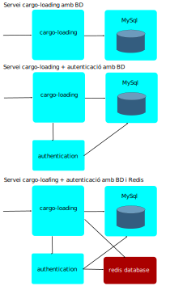
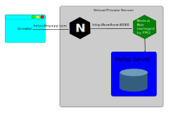
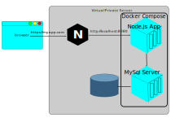

# onion-cargo-loading-service

## Descripció

Projecte d'un servei web per determinar si es poden encabir diversos elements
en un contenidor i si es així en quina disposició i ordre.
El servei ha de poder gestionar peticions de diversos clients, a on cada client
té uns contenidors preconfigurats diferents.
El servei s'ha de poder desplegar en diferents configuracions:

- Un servidor Ubunbtu amb PM2
- Un servidor Ubuntu amb docker compose
- Un o diversos servidors Ubuntu amb docker swarm
- Kubernetes
- Google Run (Serverless)

El servei es desenvoluparà amb NodeJS, ExpressJS
El loggin es farà amb Morgan i Winston.
Les API REST es faran amb Open API i swagger.
Les dades es guardaran en una BD MySql.
Es farà servir una BD Redis com a cache de la MySql.
Es testejarà amb mocha i artillery.

Posteriorment s'afegirà un altre servei per gestionar les claus de connexió
dels clients, obtenir estadístiques de connexió, poder bloquejar claus,
renovar-les i crear-ne de noves.

Com a útlim punt s'afegirà una base de dades Redis per tal de guardar en
memòria els contenidors preconfigurats i les claus de connexió dels clients
per agilitzar l'aplicació.

Hem de tenir en compte les diferents opcions de desplegament de les BD, ja que
les podrem tenir <https://cloud.google.com/blog/products/databases/to-run-or-not-to-run-a-database-on-kubernetes-what-to-consider>:

- En un o diversos VPS dedicats
- A dins de Kubernetes
- Fer servir BD autogestionades pel proveïdor de cloud, p.e. Cloud SQL o Memorystore for Redis



Es vol comprobar si una aplicació serverless feta amb contenidors realment té
els següents avantatges:

- Ús de contenidors ofereix més flexibilitat i rapidesa
- Serverless simplifica la configuració i l'escalabilitat
- Millora la productivitat dels desenvolupadors
- Facilita la recol·lecció de dades per poder obtenir coneixement i s'hi pot aplicar ML
- Redueix els costos d'infraestructura i informàtica

## Metodologies i convencions

### Disseny de les API REST

Per dissenyar les API REST s'ha de tenir en compte:

- El nivell de granularitat: si la granularitat és molt fina s'exposaran molts
  recursos i obligarà a fer moltes crides per relitzar una operació, en canvi
  si la granularitat és molt grossa hi haurà poca flexibilitat i dificultarà la
  reutilització de l'API. S'ha de triar un equilibri entre:
  - La mida de la resposta
  - El número de crides de la API
  - Mantenibilitat i reusabilitat
  - Escalabilitat
  - Necessitats del negoci
- Basar el disseny en els objectes del negoci i no en taules de la BD
- Fer servir HATEOAS per dotar d'inteligència al client, que a partir d'una
  crida sigui capaç de fer altres crides.
- Gestionar els errors de forma consistent, centralitzar els errors en un
  array JSON pot ser una bona idea. <https://www.rfc-editor.org/rfc/rfc7807>.

Exemple de crida amb HATEOAS:

```javascript
{
 “id”: 1,
 “name”: “Blog”,
 “links”: [
  {
   “href”: “1/posts”,
   “rel”: “posts”,
   “type” : “GET”
   }, 
  {
   “href”: “1/comments”,
   “rel”: “comments”,
   “type” : “GET”
   }
 ]
}
```

Exemple d'array d'errors:

```javascript
{
 “errors”: [
   {
   “code”: “10003”,
   “message”: “invalid address field”
   },
   {
   “code”: “10004”,
   “message”: “birthday field is requried”
   }
   ]
 }
```

### Versionat de les API

Es segueix <https://semver.org/>

```text
Given a version number MAJOR.MINOR.PATCH, increment the:

MAJOR version when you make incompatible API changes
MINOR version when you add functionality in a backwards compatible manner
PATCH version when you make backwards compatible bug fixes
```

### Com afegir una versió nova de la API

**Important**: crear una nova versió només quan sigui necessari i es trenqui compatibilitat amb la versió anterior.

Passos:

- Crea una carpeta nova pels controladors a dins de ./routes/vX
  - A dins de routes hi ha un `api-docs.js` que conté la documentació de la api
- Crea una carpeta nova pel models consumits pels controladors a dins de ./api/vX
- Clona els fitxers de la versió anterior a les noves carpetes i modifica el que calgui
- Edita el fitxer "app" per afegir les rutes als nous controladors

### Com treballar amb la BD MySQL

Per implementar la connexió amb MySql es consideren aquests mòduls per Nodejs i Expressjs:

- mysqljs/mysql: This is a node.js driver for mysql. It is written in JavaScript, does not require compiling, and is 100% MIT licensed.
- mysql2: A fast node.js MySQL library with focus on performance. Supports prepared statements, non-utf8 encodings, binary log protocol, compression, ssl and much more.
- sequelize: easy-to-use and promise-based Node.js ORM tool for Postgres, MySQL, MariaDB, SQLite, DB2, Microsoft SQL Server, and Snowflake. It features solid transaction support, relations, read replication and more.
- knex.js: A batteries-included, multi-dialect (PostgreSQL, MySQL, CockroachDB, MSSQL, SQLite3, Oracle (including Oracle Wallet Authentication)) query builder for Node.js
Per implementar-ho es tria fer servir mysql2 pels següents motius:

Prioritzem rendiment sobre compatibilitat, per tant descartem les ORM i query builders ja que afegixen capes i lentitut
Dels dos drivers MySql triem mysql2 ja que ofereix un rendiment superior i conté els elements bàsics per treballar amb MySql (pool de connexions i transaccions).
Per tal de treballar de forma concurrent i sense bloqueigs a partir de múltiples serveis contra la mateixa base de dades, per agafar registres i fer-hi operacions de modificació o esborrat es pot fer de diferents maneres (no fer res i el que actualitza l'últim guanya, concurrència optimista en que es suposa que hi haurà pocs conflictes i l'usuari afectat no li farà res tornar-ho a intentar), concurrència pessimista on es suposen molts conflictes i que els usuaris afectats no voldran reintantar-ho.

Nosaltres farem servir concurrència optimista amb versionat.

#### Nodejs, MySQL i Timestamps

Gotcha! Timezones in nodejs and mysql <https://medium.com/@magnusjt/gotcha-timezones-in-nodejs-and-mysql-b39e418c9d3>

MySql2 Timezone <https://github.com/sidorares/node-mysql2/issues/642>

MySQL no permet guardar el timezone en camps DATETIME o TIMESTAMP, per tal de poder guardar i recuperar aquestes dates correctament, es guardarà sempre com a UTC i serà en el client que es transformà al time zone que calgui.

**A mysql, DATE i DATETIME s'emmagatzemen com a cadenes simples. També s'envien i reben com a cadenes, sense tenir en compte les zones horàries.**

**Interpretar DATETIME com a data nova ("AAAA-MM-DD HH:mm:ss"). Això pot ser correcte si el que ha emmagatzemat el DATETIME es troba a la mateixa zona horària que tu.**

Per recuperar la data en format local es pot fer servir la funció CONVERT_TZ() en la SQL la consulta següent:

```sql
-- Convertir de UTC a la timezone de la connexió
SELECT id
       , `code`
       , CONVERT_TZ(date_start, '+00:00', @@session.time_zone)
       , CONVERT_TZ(date_final, '+00:00', @@session.time_zone)
       , `active`
       , token
       , notes 
  FROM cargo_loading.client;
```

Si es vol gestionar en Nodejs s'ha de tenir en compte:

```javascript
let d1 = new Date();  // 28/4/2023, 18:09:40
console.log(d1);                          // 2023-04-28T16:09:40.561Z
console.log(d1.toISOString());            // '2023-04-28T16:09:40.561Z'
console.log(d1.toLocaleString());         // '28/4/2023, 18:09:40'
console.log(d1.toLocaleString('en-US'));  // '4/28/2023, 6:09:40 PM'
console.log(d1.toLocaleString('es-ES'));  // '28/4/2023, 18:09:40'

let d2 = new Date('2023-04-18T16:07:50');
console.log(d2);                          // 2023-04-18T14:07:50.000Z
console.log(d2.toISOString());            // '2023-04-18T14:07:50.000Z'
console.log(d2.toLocaleString());         // '18/4/2023, 16:07:50'
console.log(d2.toLocaleString('en-US'));  // '4/18/2023, 4:07:50 PM'
console.log(d2.toLocaleString('es-ES'));  // '18/4/2023, 16:07:50'

let d3 = new Date(2023, 04, 18, 16, 7, 50);
console.log(d3);                          // 2023-05-18T14:07:50.000Z
console.log(d3.toISOString());            // '2023-05-18T14:07:50.000Z'
console.log(d3.toLocaleString());         // '18/5/2023, 16:07:50'
console.log(d3.toLocaleString('en-US'));  // '5/18/2023, 4:07:50 PM'
console.log(d3.toLocaleString('es-ES'));  // '18/5/2023, 16:07:50'

let d4 = new Date('2023-04-18 16:07:50');
console.log(d4);                          // 2023-04-18T14:07:50.000Z
console.log(d4.toISOString());            // '2023-04-18T14:07:50.000Z'
console.log(d4.toLocaleString());         // '18/4/2023, 16:07:50'
console.log(d4.toLocaleString('en-US'));  // '4/18/2023, 4:07:50 PM'
console.log(d4.toLocaleString('es-ES'));  // '18/4/2023, 16:07:50'
```

### Fer servir transaccions, locks i deadlocks

<https://lynn-kwong.medium.com/understand-the-basics-of-locks-and-deadlocks-in-mysql-part-i-92f229db0a>
<https://lynn-kwong.medium.com/understand-the-basics-of-locks-and-deadlocks-in-mysql-part-ii-6beecd183345>

## Com treballar amb el projecte

Pojecte hostatjat al GitHub, per col·laborar treballar de la següent manera:

1. Fer un fork del projecte al teu GitHub
2. Clona el codi en local
3. Crea el fitxer config/config.js amb la configuració del servei:
4. Crea una branca, posa-li un bon nom, que indiqui el tipus de canvi (bug,
   fix, feat, doc) i expliqui de que es tracta.
   Ex: "bug:error when array is null"
5. Fes els canvis i guarda'ls en local, cada canvi amb el seu commit, també amb
   un bon nom
6. Ves a la branca principal i sincronitza la teva branca master amb el del
   repositori original
7. Guarda els canvis al teu GitHub
8. Crea el pull request

Fitxer config/config.js d'exemple:

```javascript
module.exports = {
    client: "nom del client que el té desplegat",
    service: "nom del servei"
}
```

Per veure totes les rutes del projecte executar-lo amb la camanda:
`DEBUG=express:* node bin/www`

Mes info a:

- <https://www.freecodecamp.org/espanol/news/como-hacer-tu-primer-pull-request-en-github/>
- <https://betterprogramming.pub/improve-your-pull-requests-and-code-review-in-6-easy-steps-ecf6dfa1c6d5>
- <https://www.paradigmadigital.com/dev/testeo-api-rest-mocha-chai-http/>
- <https://www.freecodecamp.org/news/how-to-build-explicit-apis-with-openapi/>
- <https://github.com/kogosoftwarellc/open-api/tree/master/packages/express-openapi#readme>

## Configuració de tests i lintatge

Per tal d'assegurar que abans de cada commit es passen tots els tests i que no es puja res a github que no funcioni s'afegeix un paquet que permet executar els tests en entron de desenvlupament [amb els git hooks](https://git-scm.com/book/en/v2/Customizing-Git-Git-Hooks).

Per això afegim els paquets:

- (ESLInt)[https://github.com/eslint/eslint]
- (pre-commit)[https://pre-commit.com/]

### Configuració de eslint

Hem de configurar el es-lint per assegurar que es respecta l'estil i no hi ha errors estàtics en el codi.
Per defecte hem triat l'[estandarjs](https://standardjs.com). Les regles configurables es poden trobar [aquí](https://eslint.org/docs/latest/rules/indent#switchcase) Hi fem algunes modificacions específiques de CodeBiting.

1. Creem el fitxer `.eslintrc.js`, aquest fitxer es crea quan configurem l'eslint amb la comanda `npm init @eslint/config`.
2. Probem que funciona executant l'eslint d'un fitxer amb la comanda `node ./node_modules/.bin/eslint yourfile.js`

### Configuració de pre-commit

El paquet pre-commit executa els tests configurats al `package.json`, per això hem d'afegir una secció indicant les comandes que s'executaran:

```json
  "scripts": {
    "start": "node ./bin/www",
    "test": "node ./node_modules/mocha/bin/mocha",
    "test-apis": "node ./node_modules/mocha/bin/mocha ./test/api/",
    "test-routes": "node ./bin/www & P1=$! && sleep 2 && node ./node_modules/mocha/bin/mocha ./test/routes/v1/ && kill $P1",
    "test-eslint": "node ./node_modules/.bin/eslint app.js",
    "nodemon": "nodemon ./bin/www"
  },
  "pre-commit": [
    "test-apis",
    "test-routes",
    "test-eslint"
  ],
```

Podem veure que hem afegit els següents scripts:

- test-apis: executa els tests de les api amb mocha
- test-routes: executa els tests de les rutes amb mocha i chai-http, per aquest es següeixen els següents passos
  1. Amb `node ./bin/www & P1=$!` aixequem el servei i ens guardem el PID
  2. Amb `sleep 2` esperem 2 segons a que s'aixequi el servei
  3. Amb `node ./node_modules/mocha/bin/mocha ./test/routes/v1/` executem els tests
  4. Amb `kill $P1` tanquem el servei

En la secció `pre-commit` cridem els scripts que s'executaran abans de fer un commit. Hem de tenir en compte que:

1. S'executaran els test tant si fem un commit des de command line com de Visual Studio Code. Ex: `commit -a -m "missatge"`
2. Si un dels tests falla no es realitza el commit.

## Desplegament

### Desplegar amb PM2 en un VPS

Característiques:

1. Un sol servidor
2. Configuració senzilla
3. Poca escalabilitat
4. Entorns no aïllats



Per tal de deplegar l'aplicació amb PM2 en un servidor farem servir un script
que ens desplegui tots els components necessaris en un servidor Ubuntu de
clouding.io

En el mateix servidor hi instalarem una BD MySQL per guardar les dades.

Opcions d'escalabilitat:

1. Enlloc de crear els serveis al PM2 un a un, es pot fer servir el fitxer
   ecosystem que permet crear-los tots de cops i fer servir múltiples
   instàncies d'una mateixa app amb un balencejador de càrrega del PM2.
2. Es pot iniciar els serveis PM2 amb la opció -i que els crea en mode cluster,
   es a dir, un servei per cada CPU del servidor: `pm2 start app.js -i max`
3. Es poden aixecar nous servidors i desplegar noves instàncies, però es
   necessita un balencejador de càrrega entre tots els servidors.

Exemple opció escalabilitat 1, amb fitxer ecosystem:

```javascript
{
  "apps" : [{
    "name"        : "worker-app",
    "script"      : "./worker.js",
    "watch"       : true,
    "env": {
      "NODE_ENV": "development"
    },
    "env_production" : {
       "NODE_ENV": "production"
    }
  },{
    "name"       : "api-app",
    "script"     : "./api.js",
    "instances"  : 4,
    "exec_mode"  : "cluster"
  }]
}
```

### Construim una imatge del contenidor i l'executem

Per poder desplegar amb docker compose, swarm kubernetes o Cloud Run primer hem
de crear l'aplicació en un contenidor.

```bash
# Mirem quines imatges tenim en local
$ docker images

# Creem una imatge en local a partir del Dockerfile
# docker build --tag <nom de la nova imatge> <ruta del fitxer dockerfile>
# Posem una nova versio cada vegada
$ docker build --tag  codebiting/onion-cargo-loading:v1  .

# Verifiquem que la imatge s’ha creat correctament, per això mirem si la imatge existeix.
$ docker images

# Executem la imatge en mode interactiu
$ docker run -it -p 8080:8080 -d codebiting/onion-cargo-loading:v1

# Verifiquem que el contenidor està actiu, amb els ports correctes i mirem els logs que deixa:
$ docker ps
$ docker logs <container id>
$ docker inspcet <container id>
# Veure tots els contenidors (els finalitzats i els en execució)
$ docker ps -a

# Comprovem que l’aplicació funciona executant un navegador web l’adreça:
[http://<my.servlet.host>:8080/api-documentation](http://localhost:8080/api-documentation/)

# Entrem a dins del contenidor pel que sigui:
$ docker exec -it <container id> /bin/bash
# Si esta parat ho podem fer d aquesta manera
$ docker start -ai <container id>

# Parem l’execució del contenidor. Podem fer-ho de dues maneres diferents:
$ docker stop <container id>
$ docker kill <container id>
```

### Executem el contenidor amb docker compose

<https://docs.docker.com/compose/>
<https://docs.docker.com/compose/production/>
<https://www.educative.io/blog/docker-compose-tutorial>

Característiques:

1. Un sol servidor
2. Configuració senzilla, però més complicada que amb PM2, per gestionar
   diversos contenidors
3. Poca escalabilitat
4. Entorns aïllats

Per tal de deplegar l'aplicació amb docker compose en un servidor farem servir
un script que ens desplegui tots els components necessaris en un servidor
Ubuntu de clouding.io

Al mateix servidor hi instalarem un docker amb MySQL per guardar-hi les dades.



### Executem el contenidor amb docker swarm

<https://docs.docker.com/engine/swarm/>

Característiques:

1. Un o diversos servidors
2. Configuració complexa
3. Escalabilitat
4. Entorns aïllats

### Executem el contenidor amb kubernetes

### Executem el contenidor amb Cloud Run

## Comparativa dels diferents modes de desplegament

| Mode de desplegament | Màxima escalabilitat | Temps per canviar l'escalabilitat |
|-|-|-
| PM2 | De 1 a N serveis per servidor | Segons a minuts: s'ha de modificar l'ecosystem i reiniciar PM2 |
| Docker compose | | |
| Docker swarm | | |
| Kubernetes | | |
| Cloud Run | | |

## Comparativa dels tests amb artillery

Escenaris:

1. Un client fa N consultes per segon durant 60 segons
2. Un client durant 60 segons fan de 1 a Y consultes per segon
3. X clients fan N consultes per segon durant 60 segons
4. X clients durant 60 segons fan de 1 a Y cosultes per segon

| Mode de desplegament | Escenari 1 | Escenari 2 | Escenari 3 | Escenari 4 |
|-|-|-|-|-|
| PM2 1 servei |  |  |  |  |
| PM2 mode cluster + Redis |  |  |  |  |
| Docker compose | | |  |  |
| Docker compose + Redis | | |  |  |
| Docker swarm + Redis | | |  |  |
| Kubernetes + Redis | | |  |  |
| Cloud Run + Redis | | |  |  |

## Log de canvis

V 0.0.0 - Característiques
